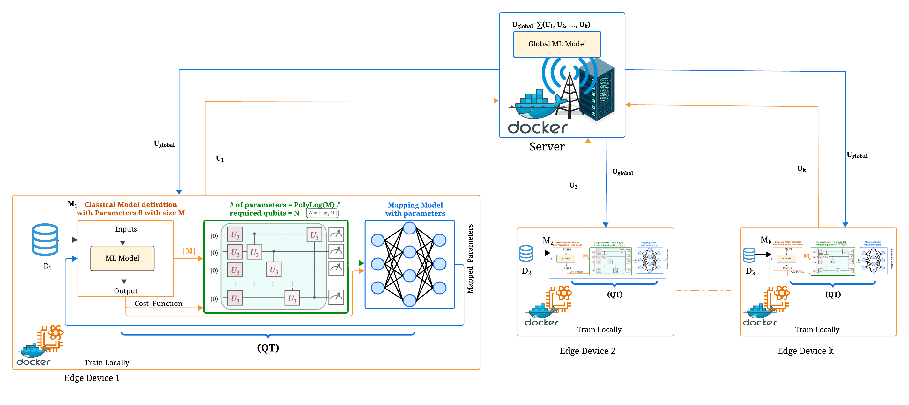

# QFed: Parameter-Compact Quantum-Classical Federated Learning
## The paper Link: [Arxiv](https://arxiv.org/abs/2601.09809).
## 🧩 System Model

<h2> 🙌 Abstract </h2>
The following figure illustrates the **proposed system**.
Organizations and enterprises across domains such as healthcare, finance, and scientific research are increasingly required to extract collective intelligence from distributed, siloed datasets while adhering to strict privacy, regulatory, and sovereignty requirements. Federated Learning (FL) enables collaborative model building without sharing sensitive raw data, but faces growing challenges posed by statistical heterogeneity, system diversity, and the computational burden from complex models. This study examines the potential of quantum-assisted federated learning, which could cut the number of parameters in classical models by polylogarithmic factors and thus lessen training overhead. Accordingly, we introduce QFed, a quantum-enabled federated learning framework aimed at boosting computational efficiency across edge device networks. We evaluate the proposed framework using the widely adopted FashionMNIST dataset. Experimental results show that QFed achieves a 77.6% reduction in the parameter count of a VGG-like model while maintaining an accuracy comparable to classical approaches in a scalable environment. These results point to the potential of leveraging quantum computing within a federated learning context to strengthen FL capabilities of edge devices.

## 📄 Citation
Please kindly cite this paper in your publications if it helps your research:

@article{abdelghani2026qfed,
  title={QFed: Parameter-Compact Quantum-Classical Federated Learning},
  author={Abdelghani, Samar and Cherkaoui, Soumaya},
  journal={arXiv preprint arXiv:2601.09809},
  year={2026}
}

